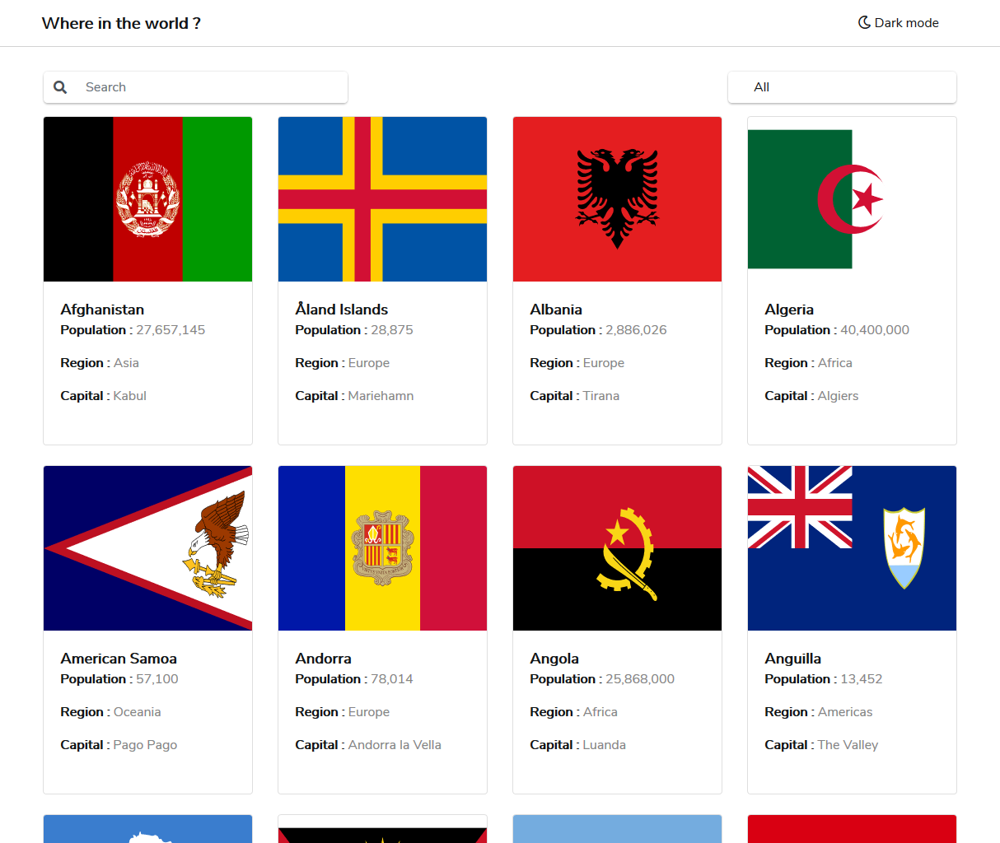

# Frontend Mentor Challenge Project - Rest countries API

## Description
This project has been created using react framework. For styles bootstrap and custom css has been used. The site also has a dark theme mode.

The site is live at : https://countriesapiproject.netlify.com/

## Screenshots



Please refer to more screenshots in [Screenshots](https://github.com/codemayank17/frontendMentor-CountriesAPIFrontend/tree/master/screenshots) folder.

## How to run

Clone the repo the run following command to run

```
npm install
npm start
```
